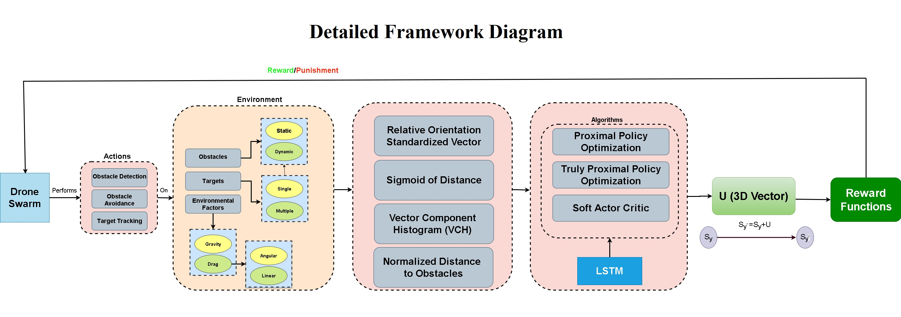
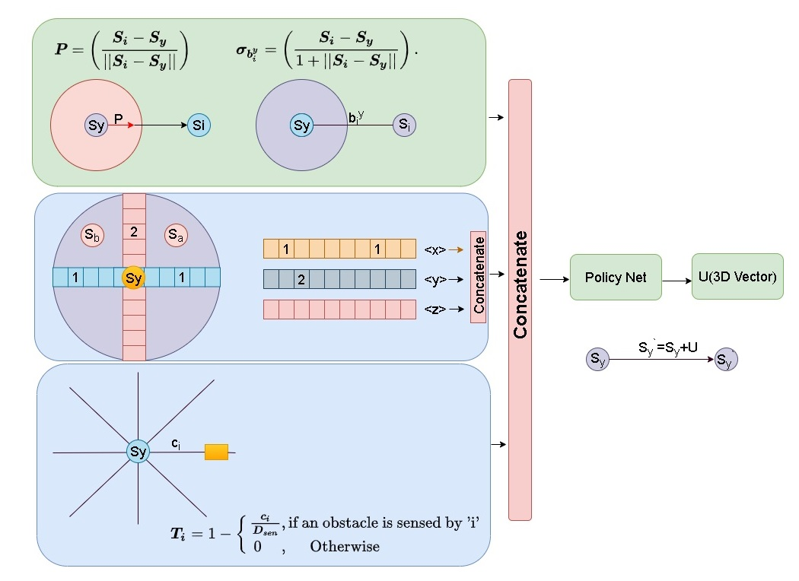
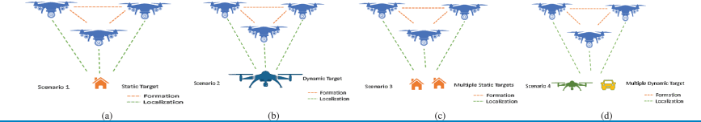
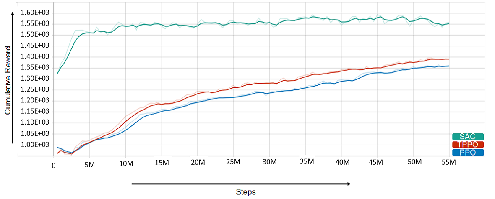
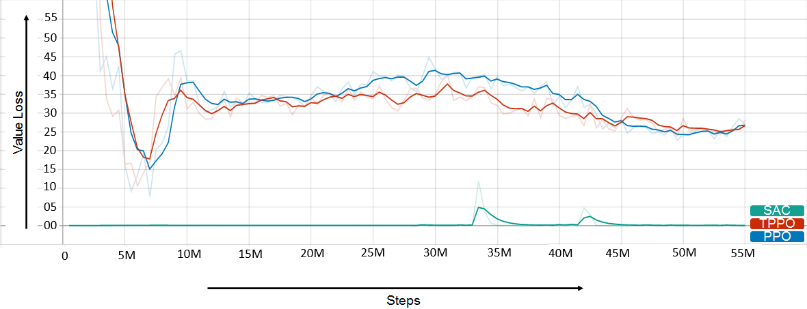
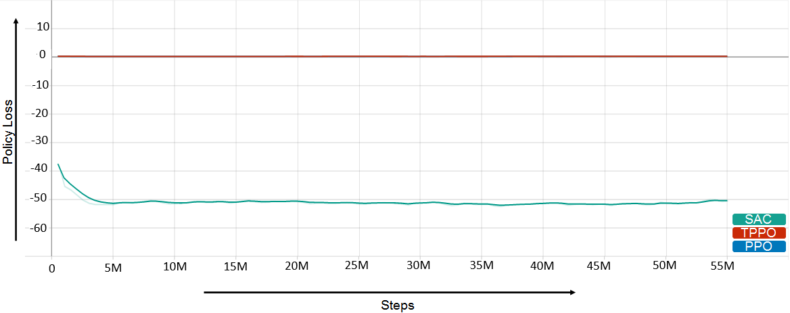
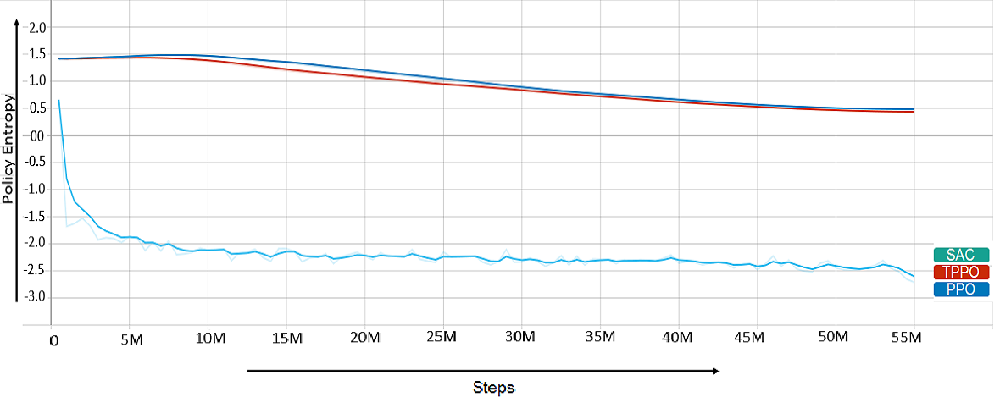

# Autonomous Drone Swarm Navigation and Multitarget Tracking With Island Policy-Based Optimization Framework
## Abstract
Swarm intelligence has been applied to replicate numerous natural processes and relatively simple species to achieve excellent performance in a variety of disciplines. An autonomous approach employing deep reinforcement learning is presented in this study for swarm navigation. In this approach, complex 3D environments with static and dynamic obstacles and resistive forces such as linear drag, angular drag, and gravity are modeled to track multiple dynamic targets. In this regard, a novel island policy optimization model is introduced to tackle multiple dynamic targets simultaneously and thus make the swarm more dynamic. Moreover, new reward functions for robust swarm formation and target tracking are devised to learn complex swarm behaviors. Since the number of agents is not fixed and has only the partial observance of the environment, swarm formation and navigation become challenging. In this regard, the proposed strategy consists of four main components to tackle the aforementioned challenges: 1) Island policy-based optimization framework with multiple targets tracking 2) Novel reward functions for multiple dynamic target tracking 3) Improved policy and critic-based framework for the dynamic swarm management 4) Memory. The dynamic swarm management phase translates basic sensory input to high-level commands and thus enhances swarm navigation and decentralized setup while maintaining the swarm’s size fluctuations. While in the island model, the swarm can split into individual sub-swarms according to the number of targets, thus allowing it to track multiple targets that are far apart. Also, when multiple targets come close to each other, these sub-swarms have the ability to rejoin and thus form a single swarm surrounding all the targets. Customized state-of-the-art policy-based deep reinforcement learning neuro-architectures are employed to achieve policy optimization. The results show that the proposed strategy enhances swarm navigation by achieving a high cumulative reward and a low policy loss. The simulations show that the proposed framework can efficiently track multiple static and dynamic targets in complex environments.
<div align="center">
  
</div>

## Creation of U (3D Vector) representing next location of drone in the 3D environment by concatenating Relative Orientation Standardized Vector, Sigmoid of Geodesic Distance, Vector Component Histogram (VCH), and Normalized Distance to Obstacles.
<div align="center">
  
</div>

## Drone Swarm surrounding and tracking, (a) Single static target (b) Single dynamic target (c) Multiple static targets (d) Multiple dynamic targets.
<div align="center">
  
</div>

## Demonstraitons
Check out demos [here](https://www.youtube.com/playlist?list=PLq0872kWvR0VqTcnWDrudsDRELvt_FY7w)
## Installation

Required:
```shell
python
cudatoolkit==11.3.1
pytorch==1.12.1
torchvision==0.13.1
Unity3D 2021.1.7
mlagents v0.23.0
tensorFlow


```
## Results
| Cumulative Reward | Value Loss |
|---------|---------|
|  |  |
| Policy Loss | Policy Entropy |
|  |  |


NOTE: Source code will be added soon.
## Citation

```
@ARTICLE{9868790,
  author={Qamar, Suleman and Khan, Saddam Hussain and Arshad, Muhammad Arif and Qamar, Maryam and Gwak, Jeonghwan and Khan, Asifullah},
  journal={IEEE Access}, 
  title={Autonomous Drone Swarm Navigation and Multitarget Tracking With Island Policy-Based Optimization Framework}, 
  year={2022},
  volume={10},
  number={},
  pages={91073-91091},
  doi={10.1109/ACCESS.2022.3202208}}
```
